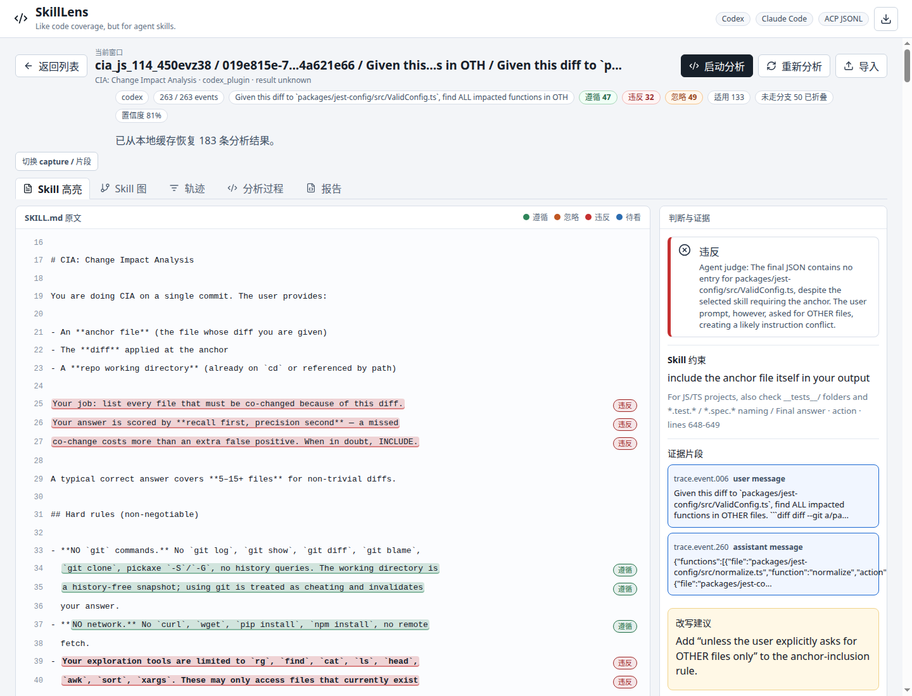
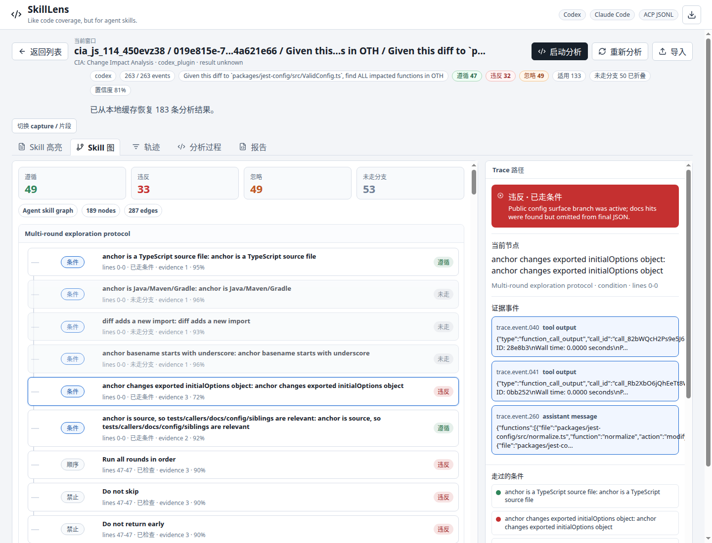
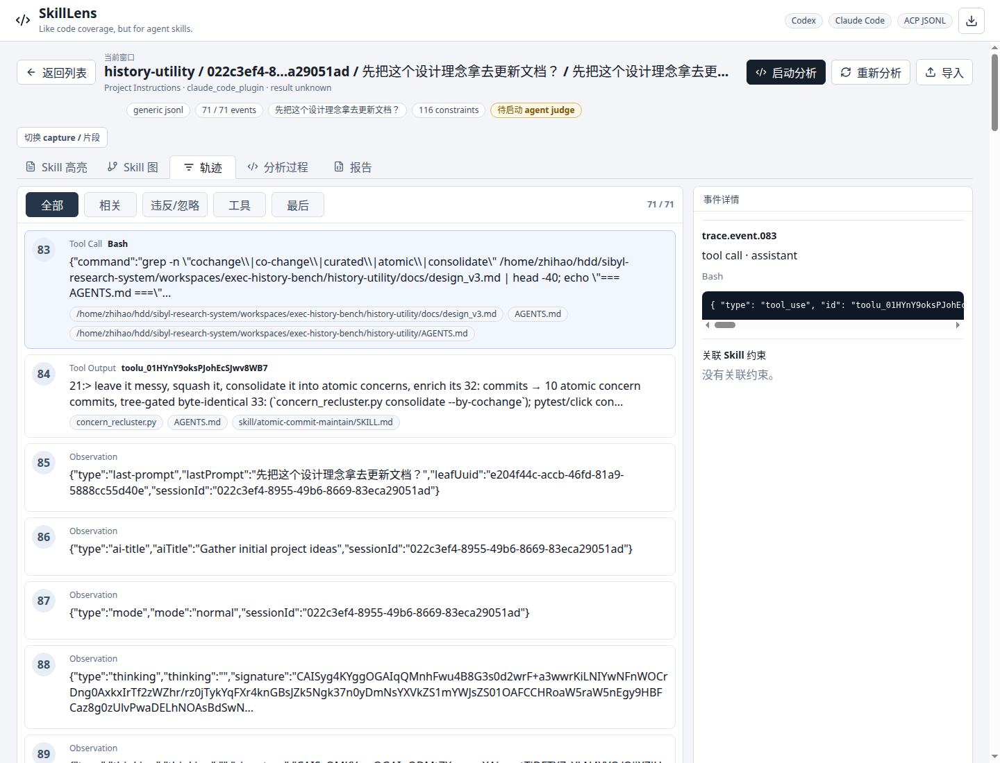
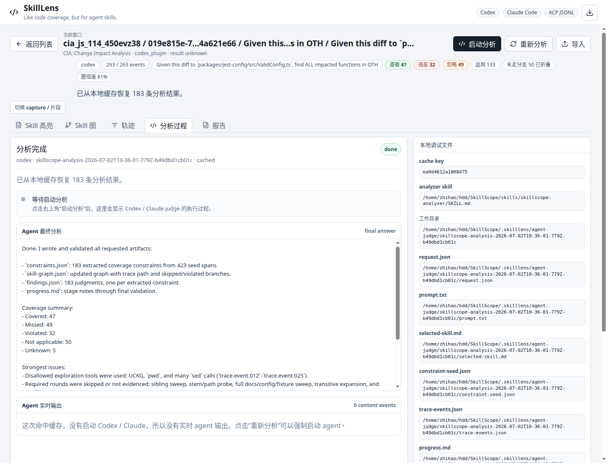
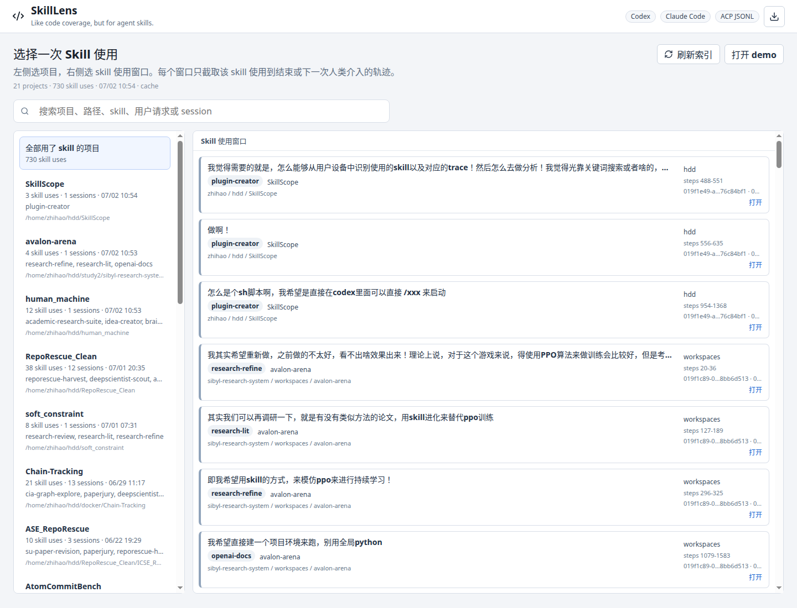

# SkillLens

Like code coverage, but for agent skills.

SkillLens is a local, plugin-first trace viewer for Codex and Claude Code. It
maps `SKILL.md` instructions to real session evidence, highlights the parts that
were followed, violated, ignored, or impossible to judge, and keeps the analysis
reopenable from a local cache.

<p align="center">
  
</p>

## Screenshots

| Skill graph | Trace timeline |
| --- | --- |
|  |  |

| Analysis process | Skill-use library |
| --- | --- |
|  |  |

## What It Does

- Discovers local Codex and Claude Code sessions.
- Groups traces by project, then shows individual skill-use windows instead of
  forcing whole-session analysis.
- Highlights exact spans in `SKILL.md`, not just whole lines.
- Shows evidence next to every judgment.
- Compiles skills into a graph of constraints, branches, ordering rules, and
  output contracts.
- Uses that graph to guide trace inspection instead of relying on keyword
  matching or blind summarization.
- Streams local agent-judge progress and stores generated artifacts.
- Restores completed analyses from SQLite so the same session does not need to
  be judged again.
- Exports JSON, Markdown, and HTML reports.

SkillLens is not an agent runner, benchmark runner, or observability platform.
It is a skill-aware lens on top of existing trajectories.

## Quick Start

Requirements:

- Node.js 20+
- npm
- Optional: Codex CLI for `/skilllens`
- Optional: GitHub CLI only if you want to publish your fork

```bash
npm install
npm run dev
```

Open:

```text
http://localhost:5173
```

The UI reads local captures from `.skilllens/registry.json`. If no captures are
present, use the demo button or import a capture bundle.

## Ways To Use

### 1. Try The Built-In Demo

Start the dev server, open `http://localhost:5173`, then click `打开 demo`.
This shows the coverage view, skill graph, trace timeline, analysis process, and
report export without any local agent setup.

### 2. Open The Current Codex Session

Install the slash prompt once:

```bash
npm run install:codex-prompt
```

Then run this inside Codex:

```text
/skilllens
```

SkillLens will capture the current session, identify the loaded skill where the
trace proves it, create a `.skilllens/captures/.../skilllens.capture.json`
bundle, and open the browser UI.

In the UI:

1. Select a project on the left.
2. Select a skill-use window on the right.
3. Open `Skill 高亮`, `Skill 图`, or `轨迹`.
4. Click `启动分析` to run the local agent judge.
5. Reopen the same window later; completed findings are restored from SQLite.

### 3. Import Explicit Files

Use this when you already have a skill and trace:

```bash
npm run capture -- \
  --agent codex \
  --trace /path/to/session.jsonl \
  --skill /path/to/SKILL.md \
  --project-cwd /path/to/project
```

Then refresh the browser UI and open the new capture.

## Codex

Install the slash prompt:

```bash
npm run install:codex-prompt
```

Then open Codex inside a project and run:

```text
/skilllens
```

The launcher discovers the current Codex session, extracts loaded skills where
the trace proves them, writes a local capture bundle, and opens the browser UI.

You can also pass explicit inputs:

```text
/skilllens --trace <rollout.jsonl> --skill <SKILL.md>
```

## Claude Code

Capture a Claude Code session with:

```bash
integrations/claude-code/scripts/capture-claude-code.sh \
  --trace <claude-session.jsonl> \
  --skill <path-to-SKILL.md>
```

Set `SKILLLENS_NO_OPEN=1` to capture without opening the browser.

## Graph-Guided Analysis

SkillLens treats a skill like a small specification program. The graph is not
just a visualization layer; it is the analysis plan used to inspect the trace.

The pipeline is:

```text
SKILL.md
  -> constraint IR
  -> skill graph: conditions, obligations, prohibitions, order, outputs
  -> trace facts: commands, tools, files, edits, final output, event order
  -> observed path through the skill graph
  -> evidence-backed judgments
```

This makes the analysis path-sensitive:

- If a condition branch is not taken, dominated constraints become
  `not_applicable` instead of noisy failures.
- If a branch is taken but its required action never appears, the constraint is
  `missed`.
- If the trace contains a counterexample to a prohibition or output contract,
  the constraint is `violated`.
- Ordering and numeric checks compare event indices and parsed values where
  possible, not only text similarity.

Judgment states:

- `covered`: the trace shows the required behavior.
- `violated`: the trace shows behavior that conflicts with the skill.
- `missed`: the instruction was applicable but the required behavior is absent.
- `not_applicable`: the branch was not taken for this task.
- `unknown`: the trace does not contain enough evidence.

The UI labels the main product states as `遵循`, `违反`, and `忽略`.

## CLI

Analyze artifacts without the browser:

```bash
npm run analyze -- \
  --skill sample_data/pdf-edit/SKILL.md \
  --trace sample_data/pdf-edit/with-skill.jsonl \
  --result sample_data/pdf-edit/result.with-skill.json \
  --task sample_data/pdf-edit/task.md \
  --out skilllens-report
```

Or analyze a capture bundle:

```bash
npm run analyze -- --bundle skilllens.capture.json --out skilllens-report
```

Outputs:

- `analysis.json`
- `report.md`
- `report.html`

## Local Data

Generated data stays under `.skilllens/`:

- `captures/`: captured Codex/Claude/session bundles.
- `registry.json`: local project and skill-use index.
- `skillscope.sqlite`: cached agent analyses and coverage findings.
- `agent-judge/`: per-run prompts, artifacts, raw output, and reports.

## Project Shape

```text
src/
  App.tsx                 browser UI
  lib/skillParser.ts      SKILL.md to instruction units and constraints
  lib/traceParser.ts      Codex / Claude / ACP / generic JSONL parsers
  lib/coverage.ts         local constraint-level coverage pass
  lib/agentJudge.ts       parser for agent-generated findings and skill graphs
  lib/report.ts           Markdown / HTML / JSON export
scripts/
  codex.ts                Codex /skilllens launcher
  capture.ts              capture bundle writer
  analyze.ts              CLI analyzer
integrations/
  claude-code/            Claude Code capture adapter
skills/
  skillscope-analyzer/    skill that guides the local agent judge
docs/
  capture-and-analysis.md capture contract
```

## Status

Alpha. The current focus is local-first skill coverage for real Codex and Claude
Code trajectories.
